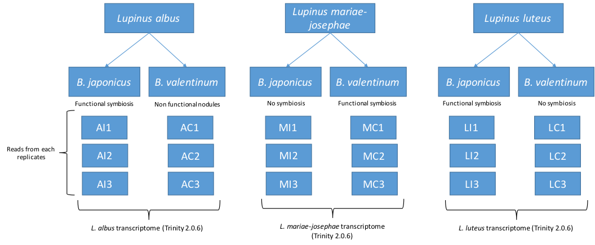
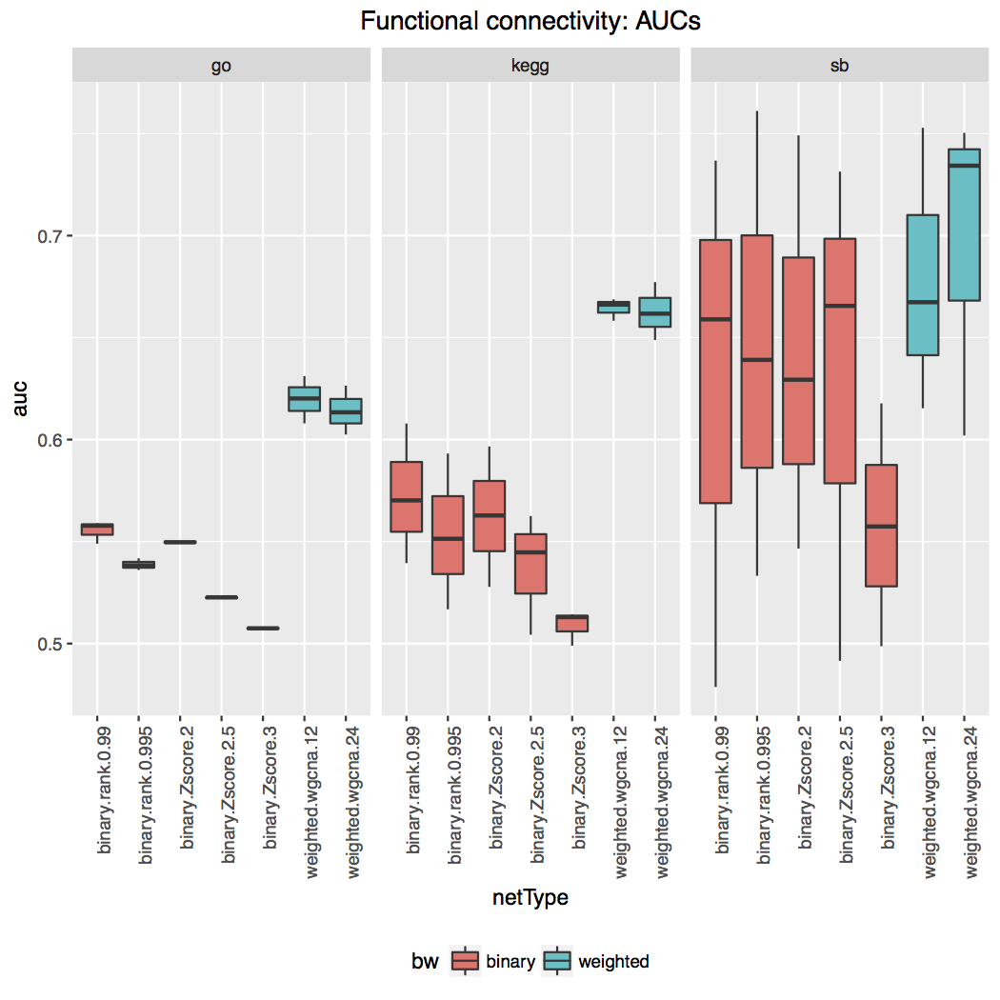
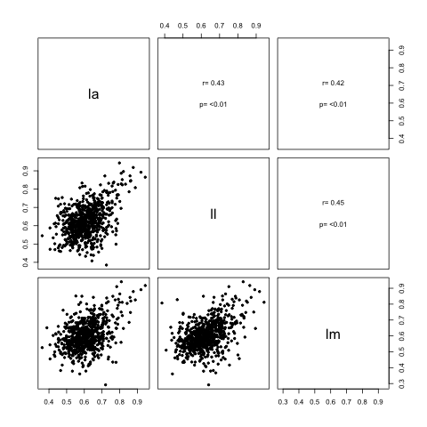
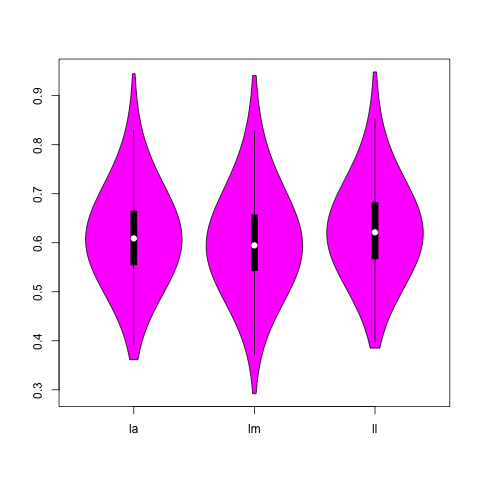

% Network analysis of symbiotic association in *Lupinus*
% Guanjing Hu
% June, 2017

# Background
Inside a legume genus *Lupinus*, species may form symbiotic association with different bacteria species, or a specific relationship with only one species of bacteria. For example, *L. albus* can be associated with different bacteria species whereas *L. mariae-josephae* is specific to *Bradyrhizobium valentinum*.

We are interested in genes which could be responsible for this specificity. Last year, we cultivated 3 lupine species with two different bacteria strains and three replicates each time (so we had compatible, and uncompatible situations). We performed RNAseq Illumina (High-seq 2000) sequencing for each replicates and we pooled all reads for each species (e.g : for L. albus, we pooled the three replicates with the first bacteria and the three replicates with the second bacteria in one file). Then, these super-datasets were subjected to Trinity (2.0.6) for assembly. Finally, chimeras were detected and removed. Below, a schema summarizing the process: 


# About co-expression gene network analysis 

**Objectives**: We would like to construct the co-expression network for each species, and conduct comparative network analysis to find common sub-network structures or conserved functional modules (closely clustered genes with related biological functions) among three different *Lupinus* species.

**Challenges**: For co-expression network construction based on Pearson correlation (r) matrix, it is not ideal to use only 6 samples per species, given the high level of noise due to small sample size. Therefore, describing topological details for individual species network is prone to errors, and direct network alignment (whether and how individual nodes and edges in one networking having counterparts in the other network) across species becomes even more problematic and sensitive to noise.

Therefore, approporiate precautions should be taken into considerations; for example:

- More stringent threshold should be applied to define co-expression relaionships, e.g. using higher cutoff for Pearson correlations to filter out weak edges.
- Restrict network construction to those genes with strong biological signals, like genes exhibiting significant differential expression.
- When analyzing network features, focus on module-level characteristics and avoid over-interpretation of changes on certain nodes and edges.
- Always consider statistical significance of results before making conclusions.

# Analytic workflow
| Steps | PlanA | PlanB |      
|-------|-------|-------|
|1| Network construction | Network construction |
|2| Network alignment | Functional connectivity calculation  |
|3| Identify conserved and diverged modules | Compare functional groups |
|4| Annotate modules of interest |  ... |


## Plan A
We tried several tools for its step 2 and 3, but failed to get them work:

- [OrthoClust](https://github.com/gersteinlab/OrthoClust) (Yan et al, Genome Biology 2014) integrates networks built for individual species using orthology relationships of genes between species, which detects co-expression modules that range from being highly conserved cross species to species-specific. **Written in Julia.**
- [isorankN](http://groups.csail.mit.edu/cb/mna/), a global multiple-network alignment tool based on spectral clustering on the induced graph of pairwise alignment scores. **Terminated when reading network matrix, reason unknown**
- [multiMAGNA++](http://www3.nd.edu/~cone/multiMAGNA++/) is a method for multiple (global) network alignment. **Error reported reading node similarity files.**

Other methods for network alignment were not tested, including [NetworkBlast-M](http://www.cs.tau.ac.il/%7Ebnet/License-nbm.htm), [GraphAlignment](http://bioconductor.org/packages/2.2/bioc/html/GraphAlignment.html), [SMAL](http://haddock6.sfsu.edu/smal/smal.py?page=home), [ModuleAlign](http://ttic.uchicago.edu/~hashemifar/ModuleAlign.html), [SANA](https://arxiv.org/abs/1607.02642), [Graemlin](http://graemlin.stanford.edu/download.php). Because those methods were mostly developed for protein-protein interaction network, which is more curated and much less dense (fewer edges!!) than co-expression gene network, it appears quite challenging to adapt methods to our datasets without better understanding of their computational algorithms.

## Plan B
This workflow skipped network alignment or any direct comparisons of network topology, which could be a more suitable approach for our datasets, which generates very noisy networks. **Functional connectivity**(FC) refers to the degree how genes belong to a given functional category (e.g. GO annotation) are connected in network. Here, **higher FC in one species indicates potential functionality involved in forming symbiotic association with bacteria according to the "Guilt-By-Association" principle**. Functional categories that exhibit high FC consistently across three species are most likely to play an important role in symbiosis common to genus *Lupinus*, while highly connected functional groups specific to each species may indicate species-specific recruitment.

Data analysis of Plan B was conducted in R:

- R functions used by below scripts: [FC.FUN.r](FC.FUN.r)
- Step 1 & 2: [fc.r](fc.r)
- Step 3: [fc.summary.r](fc.summary.r) 

# Preliminary results
## WGCNA outperforms other binary network construction methods
A series of networks were constructed for three species, based on their expression profiles ("`Proteins/3.LX_normCounts_nolowcounts_prot.txt`"). 

#### Table. Networks constructed for FC analysis per species
| net | edge     | metric | cutoff | desc              |
|-----|----------|--------|--------|-------------------|
| 1   | binary   | rank   | 0.99   | binary.rank.0.99  |
| 2   | binary   | rank   | 0.995  | binary.rank.0.995 |
| 3   | binary   | Zscore | 2      | binary.Zscore.2   |
| 4   | binary   | Zscore | 2.5    | binary.Zscore.2.5 |
| 5   | binary   | Zscore | 3      | binary.Zscore.3   |
| 6   | weighted | wgcna  | 12     | weighted.wgcna.12 |
| 7   | weighted | wgcna  | 24     | weighted.wgcna.24 |


Using the measurement of functional connectivity (FC) to evaluate how well the resulted network topology connects genes of similiar functions (GO, KEGG and the curated list of genes involved in symbiosis) together, WGCNA networks display higher FC (measured in AUCs) than other types of networks. Thus, following analysis and results were derived from WGCNA networks.


## Functional connectivity of GO terms
A total of 870 GO terms containing 10 to 500 member genes from at least one of three *Lupinus* transcriptomems were tested for functional connectivity (FC), which is measured in ROC AUC (area under receiver operating characteristic curve) values using R package EGAD [@Ballouz_EGAD_2017]. Generally, AUC value of 0.5 is random, 0.7 is generally good and 0.9 or above is very high. The average GO term FC of each species ranged from 0.60 to 0.63. **The full list of average AUC values for all network types is saved as  "`Orthologs_detection/Functional connectivity/summaryFC.txt`".**

Pearson's correlation analysis showed that FC values of GO terms were modestly correlated between any two species (r=0.42-0.45, p<0.05). Wilcoxon signed-rank test showed that functional connectivity of *L.luteus* (*ll*) is different from *L. maruae-josephae* (*lm*) and *L. albus* (*la*), while no significance difference was found between *lm* and *la*. 




Below I listed GO terms with high connectivity (AUC>0.7) from all three species. Nothing looks too exciting to me, any comments?? **The whole result table can be found as "`Orthologs_detection/Functional connectivity/go.aucs.txt`".**

| id         | la          | ll          | lm          | Term                                                                                     |
|------------|-------------|-------------|-------------|------------------------------------------------------------------------------------------|
| GO:0000462 | 0.800741707 | 0.73258547  | 0.864151317 | maturation of SSU-rRNA from tricistronic rRNA transcript (SSU-rRNA, 5.8S rRNA, LSU-rRNA) |
| GO:0000502 | 0.763342179 | 0.832882691 | 0.721756902 | proteasome complex                                                                       |
| GO:0000786 | 0.808478646 | 0.886675138 | 0.750179377 | nucleosome                                                                               |
| GO:0002181 | 0.876836711 | 0.918195751 | 0.879116165 | cytoplasmic translation                                                                  |
| GO:0003735 | 0.858620701 | 0.872530882 | 0.84252979  | structural constituent of ribosome                                                       |
| GO:0003777 | 0.726646476 | 0.789289444 | 0.8386219   | microtubule motor activity                                                               |
| GO:0005685 | 0.792626116 | 0.768855272 | 0.831017908 | U1 snRNP                                                                                 |
| GO:0005747 | 0.798631614 | 0.943037014 | 0.811703801 | mitochondrial respiratory chain complex I                                                |
| GO:0005788 | 0.785028295 | 0.767289715 | 0.705463959 | endoplasmic reticulum lumen                                                              |
| GO:0005840 | 0.791005183 | 0.825202326 | 0.792954844 | ribosome                                                                                 |
| GO:0005852 | 0.774624609 | 0.716986181 | 0.826619079 | eukaryotic translation initiation factor 3 complex                                       |
| GO:0005871 | 0.735751083 | 0.778575075 | 0.815551632 | kinesin complex                                                                          |
| GO:0006412 | 0.814336468 | 0.851887891 | 0.811640309 | translation                                                                              |
| GO:0006891 | 0.757113539 | 0.816903864 | 0.731586808 | intra-Golgi vesicle-mediated transport                                                   |
| GO:0007018 | 0.76146925  | 0.786519248 | 0.849484532 | microtubule-based movement                                                               |
| GO:0009834 | 0.862865211 | 0.846676054 | 0.819514504 | plant-type secondary cell wall biogenesis                                                |
| GO:0016760 | 0.814849399 | 0.823246272 | 0.727767976 | cellulose synthase (UDP-forming) activity                                                |
| GO:0022625 | 0.920473205 | 0.892333539 | 0.890982995 | cytosolic large ribosomal subunit                                                        |
| GO:0022626 | 0.888449322 | 0.808008111 | 0.826697961 | cytosolic ribosome                                                                       |
| GO:0022627 | 0.944732332 | 0.865171952 | 0.917146991 | cytosolic small ribosomal subunit                                                        |
| GO:0030126 | 0.860967862 | 0.843256105 | 0.747543691 | COPI vesicle coat                                                                        |
| GO:0030244 | 0.786437908 | 0.769145836 | 0.773528581 | cellulose biosynthetic process                                                           |
| GO:0030687 | 0.783355081 | 0.750864677 | 0.910263143 | preribosome, large subunit precursor                                                     |
| GO:0032040 | 0.809366863 | 0.82899606  | 0.940941927 | small-subunit processome                                                                 |


## Thoughts about functional connectivity of pathways
Previously I planned to use KEGG pathway annotation to conduct FC analysis, as for GO annotations. Given that each mapped KO term (KEGG Orthology) refers to the molecular function of the annotated gene, KO terms need to be mapped to either reference pathway maps or organism-specific pathway maps. 

I am still working on the KEGG analysis based on reference maps, but I noticed that an organism-specific pathway map exists for [Lupinus angustifolius](http://www.kegg.jp/kegg-bin/show_pathway?lang01100). This pathway map contains KEGG annotation for each reference gene of assembly [LupAngTanjil_v1.0](https://www.ncbi.nlm.nih.gov/assembly/GCF_001865875.1). I am not exactly sure how to use these information yet. Any suggestion or comments will be helpful!

# Reference